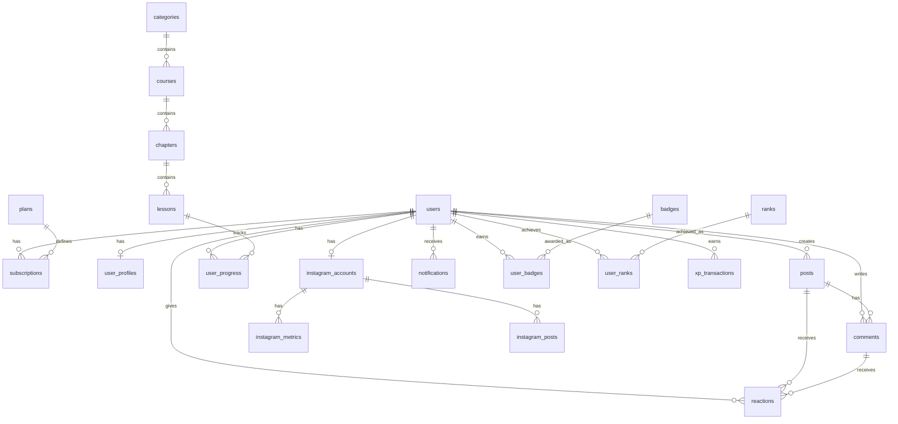

# データベース設計書

## 1. データベース概要

### 1.1 DBMS情報

- **DBMS**: PostgreSQL 15+
- **文字コード**: UTF-8
- **タイムゾーン**: Asia/Tokyo (JST)
- **照合順序**: ja_JP.UTF-8

### 1.2 命名規則

- **テーブル名**: snake_case、複数形（例: `users`, `video_lessons`）
- **カラム名**: snake_case（例: `user_id`, `created_at`）
- **主キー**: `id` (UUID)
- **外部キー**: `{参照テーブル名}_id`（例: `user_id`）
- **インデックス**: `idx_{テーブル名}_{カラム名}`
- **制約**: `{種類}_{テーブル名}_{カラム名}`

### 1.3 共通カラム

全テーブルに以下のカラムを含める:

| カラム名 | 型 | 説明 |
|---------|---|------|
| id | UUID | 主キー（デフォルト: gen_random_uuid()） |
| created_at | TIMESTAMP WITH TIME ZONE | 作成日時（デフォルト: CURRENT_TIMESTAMP） |
| updated_at | TIMESTAMP WITH TIME ZONE | 更新日時（トリガーで自動更新） |

---

## 2. ER図



---

## 3. テーブル定義詳細

### 3.1 会員管理系テーブル

#### 3.1.1 users（会員）

会員の基本情報を管理

| カラム名 | 型 | NULL | デフォルト | 説明 |
|---------|---|------|----------|------|
| id | UUID | NO | gen_random_uuid() | 主キー |
| email | VARCHAR(255) | NO | - | メールアドレス（ユニーク） |
| email_verified | BOOLEAN | NO | false | メール認証済みフラグ |
| password_hash | VARCHAR(255) | YES | NULL | パスワードハッシュ（OAuth時はNULL） |
| name | VARCHAR(100) | NO | - | 氏名 |
| nickname | VARCHAR(50) | YES | NULL | ニックネーム |
| avatar_url | TEXT | YES | NULL | プロフィール画像URL |
| status | VARCHAR(20) | NO | 'pending' | ステータス（pending/active/suspended/cancelled） |
| role | VARCHAR(20) | NO | 'member' | ロール（member/admin/super_admin） |
| last_login_at | TIMESTAMP WITH TIME ZONE | YES | NULL | 最終ログイン日時 |
| deleted_at | TIMESTAMP WITH TIME ZONE | YES | NULL | 削除日時（論理削除） |
| created_at | TIMESTAMP WITH TIME ZONE | NO | CURRENT_TIMESTAMP | 作成日時 |
| updated_at | TIMESTAMP WITH TIME ZONE | NO | CURRENT_TIMESTAMP | 更新日時 |

**インデックス**:
```sql
CREATE UNIQUE INDEX idx_users_email ON users(email) WHERE deleted_at IS NULL;
CREATE INDEX idx_users_status ON users(status);
CREATE INDEX idx_users_role ON users(role);
CREATE INDEX idx_users_last_login_at ON users(last_login_at);
```

**制約**:
```sql
ALTER TABLE users ADD CONSTRAINT chk_users_status
    CHECK (status IN ('pending', 'active', 'suspended', 'cancelled'));
ALTER TABLE users ADD CONSTRAINT chk_users_role
    CHECK (role IN ('member', 'admin', 'super_admin'));
```

---

#### 3.1.2 user_profiles（会員詳細プロフィール）

会員の詳細情報を管理（1:1関係）

| カラム名 | 型 | NULL | デフォルト | 説明 |
|---------|---|------|----------|------|
| id | UUID | NO | gen_random_uuid() | 主キー |
| user_id | UUID | NO | - | 外部キー（users.id） |
| bio | TEXT | YES | NULL | 自己紹介（500文字まで） |
| website_url | TEXT | YES | NULL | ウェブサイトURL |
| twitter_handle | VARCHAR(50) | YES | NULL | Twitter（X）ハンドル |
| location | VARCHAR(100) | YES | NULL | 所在地 |
| birthday | DATE | YES | NULL | 誕生日 |
| gender | VARCHAR(20) | YES | NULL | 性別 |
| occupation | VARCHAR(100) | YES | NULL | 職業 |
| created_at | TIMESTAMP WITH TIME ZONE | NO | CURRENT_TIMESTAMP | 作成日時 |
| updated_at | TIMESTAMP WITH TIME ZONE | NO | CURRENT_TIMESTAMP | 更新日時 |

**インデックス**:
```sql
CREATE UNIQUE INDEX idx_user_profiles_user_id ON user_profiles(user_id);
```

**外部キー**:
```sql
ALTER TABLE user_profiles ADD CONSTRAINT fk_user_profiles_user_id
    FOREIGN KEY (user_id) REFERENCES users(id) ON DELETE CASCADE;
```

---

#### 3.1.3 oauth_accounts（OAuth連携アカウント）

ソーシャルログイン連携情報

| カラム名 | 型 | NULL | デフォルト | 説明 |
|---------|---|------|----------|------|
| id | UUID | NO | gen_random_uuid() | 主キー |
| user_id | UUID | NO | - | 外部キー（users.id） |
| provider | VARCHAR(50) | NO | - | プロバイダ（google/line） |
| provider_account_id | VARCHAR(255) | NO | - | プロバイダ側のアカウントID |
| access_token | TEXT | YES | NULL | アクセストークン（暗号化） |
| refresh_token | TEXT | YES | NULL | リフレッシュトークン（暗号化） |
| expires_at | TIMESTAMP WITH TIME ZONE | YES | NULL | トークン有効期限 |
| created_at | TIMESTAMP WITH TIME ZONE | NO | CURRENT_TIMESTAMP | 作成日時 |
| updated_at | TIMESTAMP WITH TIME ZONE | NO | CURRENT_TIMESTAMP | 更新日時 |

**インデックス**:
```sql
CREATE UNIQUE INDEX idx_oauth_provider_account
    ON oauth_accounts(provider, provider_account_id);
CREATE INDEX idx_oauth_user_id ON oauth_accounts(user_id);
```

---

#### 3.1.4 plans（プラン定義）

サブスクリプションプランのマスターデータ

| カラム名 | 型 | NULL | デフォルト | 説明 |
|---------|---|------|----------|------|
| id | UUID | NO | gen_random_uuid() | 主キー |
| name | VARCHAR(100) | NO | - | プラン名 |
| description | TEXT | YES | NULL | プラン説明 |
| price | INTEGER | NO | - | 価格（円） |
| billing_interval | VARCHAR(20) | NO | 'monthly' | 請求間隔（monthly/yearly） |
| stripe_price_id | VARCHAR(100) | YES | NULL | Stripe Price ID |
| features | JSONB | YES | NULL | 機能一覧（JSON） |
| is_active | BOOLEAN | NO | true | 有効フラグ |
| sort_order | INTEGER | NO | 0 | 表示順 |
| created_at | TIMESTAMP WITH TIME ZONE | NO | CURRENT_TIMESTAMP | 作成日時 |
| updated_at | TIMESTAMP WITH TIME ZONE | NO | CURRENT_TIMESTAMP | 更新日時 |

**インデックス**:
```sql
CREATE INDEX idx_plans_is_active ON plans(is_active);
CREATE INDEX idx_plans_sort_order ON plans(sort_order);
```

---

#### 3.1.5 subscriptions（サブスクリプション）

会員の契約状況

| カラム名 | 型 | NULL | デフォルト | 説明 |
|---------|---|------|----------|------|
| id | UUID | NO | gen_random_uuid() | 主キー |
| user_id | UUID | NO | - | 外部キー（users.id） |
| plan_id | UUID | NO | - | 外部キー（plans.id） |
| stripe_subscription_id | VARCHAR(100) | YES | NULL | Stripe Subscription ID |
| stripe_customer_id | VARCHAR(100) | YES | NULL | Stripe Customer ID |
| status | VARCHAR(20) | NO | 'active' | ステータス（active/overdue/cancelled） |
| current_period_start | TIMESTAMP WITH TIME ZONE | NO | - | 現在の請求期間開始日 |
| current_period_end | TIMESTAMP WITH TIME ZONE | NO | - | 現在の請求期間終了日 |
| cancel_at_period_end | BOOLEAN | NO | false | 期間終了時に解約フラグ |
| cancelled_at | TIMESTAMP WITH TIME ZONE | YES | NULL | 解約日時 |
| created_at | TIMESTAMP WITH TIME ZONE | NO | CURRENT_TIMESTAMP | 作成日時 |
| updated_at | TIMESTAMP WITH TIME ZONE | NO | CURRENT_TIMESTAMP | 更新日時 |

**インデックス**:
```sql
CREATE INDEX idx_subscriptions_user_id ON subscriptions(user_id);
CREATE INDEX idx_subscriptions_plan_id ON subscriptions(plan_id);
CREATE UNIQUE INDEX idx_subscriptions_stripe_id ON subscriptions(stripe_subscription_id);
CREATE INDEX idx_subscriptions_status ON subscriptions(status);
```

---

### 3.2 学習管理系テーブル

#### 3.2.1 categories（カテゴリ）

動画コンテンツのカテゴリ

| カラム名 | 型 | NULL | デフォルト | 説明 |
|---------|---|------|----------|------|
| id | UUID | NO | gen_random_uuid() | 主キー |
| name | VARCHAR(100) | NO | - | カテゴリ名 |
| slug | VARCHAR(100) | NO | - | URLスラッグ（ユニーク） |
| description | TEXT | YES | NULL | 説明 |
| icon_url | TEXT | YES | NULL | アイコンURL |
| sort_order | INTEGER | NO | 0 | 表示順 |
| is_active | BOOLEAN | NO | true | 有効フラグ |
| created_at | TIMESTAMP WITH TIME ZONE | NO | CURRENT_TIMESTAMP | 作成日時 |
| updated_at | TIMESTAMP WITH TIME ZONE | NO | CURRENT_TIMESTAMP | 更新日時 |

**インデックス**:
```sql
CREATE UNIQUE INDEX idx_categories_slug ON categories(slug);
CREATE INDEX idx_categories_sort_order ON categories(sort_order);
```

---

#### 3.2.2 courses（コース）

学習コース

| カラム名 | 型 | NULL | デフォルト | 説明 |
|---------|---|------|----------|------|
| id | UUID | NO | gen_random_uuid() | 主キー |
| category_id | UUID | NO | - | 外部キー（categories.id） |
| title | VARCHAR(255) | NO | - | コースタイトル |
| slug | VARCHAR(255) | NO | - | URLスラッグ（ユニーク） |
| description | TEXT | YES | NULL | 説明 |
| thumbnail_url | TEXT | YES | NULL | サムネイルURL |
| level | VARCHAR(20) | NO | 'beginner' | レベル（beginner/intermediate/advanced） |
| duration_minutes | INTEGER | YES | NULL | 総再生時間（分） |
| sort_order | INTEGER | NO | 0 | 表示順 |
| is_published | BOOLEAN | NO | false | 公開フラグ |
| published_at | TIMESTAMP WITH TIME ZONE | YES | NULL | 公開日時 |
| created_at | TIMESTAMP WITH TIME ZONE | NO | CURRENT_TIMESTAMP | 作成日時 |
| updated_at | TIMESTAMP WITH TIME ZONE | NO | CURRENT_TIMESTAMP | 更新日時 |

**インデックス**:
```sql
CREATE UNIQUE INDEX idx_courses_slug ON courses(slug);
CREATE INDEX idx_courses_category_id ON courses(category_id);
CREATE INDEX idx_courses_is_published ON courses(is_published);
```

---

#### 3.2.3 chapters（チャプター）

コース内のチャプター

| カラム名 | 型 | NULL | デフォルト | 説明 |
|---------|---|------|----------|------|
| id | UUID | NO | gen_random_uuid() | 主キー |
| course_id | UUID | NO | - | 外部キー（courses.id） |
| title | VARCHAR(255) | NO | - | チャプタータイトル |
| description | TEXT | YES | NULL | 説明 |
| sort_order | INTEGER | NO | 0 | 表示順 |
| created_at | TIMESTAMP WITH TIME ZONE | NO | CURRENT_TIMESTAMP | 作成日時 |
| updated_at | TIMESTAMP WITH TIME ZONE | NO | CURRENT_TIMESTAMP | 更新日時 |

**インデックス**:
```sql
CREATE INDEX idx_chapters_course_id ON chapters(course_id);
CREATE INDEX idx_chapters_sort_order ON chapters(sort_order);
```

---

#### 3.2.4 lessons（レッスン・動画）

実際の動画レッスン

| カラム名 | 型 | NULL | デフォルト | 説明 |
|---------|---|------|----------|------|
| id | UUID | NO | gen_random_uuid() | 主キー |
| chapter_id | UUID | NO | - | 外部キー（chapters.id） |
| title | VARCHAR(255) | NO | - | レッスンタイトル |
| description | TEXT | YES | NULL | 説明 |
| video_provider | VARCHAR(20) | NO | 'vimeo' | 動画プロバイダ（vimeo/youtube） |
| video_id | VARCHAR(100) | NO | - | プロバイダ側の動画ID |
| video_url | TEXT | YES | NULL | 動画URL |
| thumbnail_url | TEXT | YES | NULL | サムネイルURL |
| duration_seconds | INTEGER | YES | NULL | 再生時間（秒） |
| sort_order | INTEGER | NO | 0 | 表示順 |
| is_free | BOOLEAN | NO | false | 無料公開フラグ |
| required_plan_id | UUID | YES | NULL | 必要なプランID |
| created_at | TIMESTAMP WITH TIME ZONE | NO | CURRENT_TIMESTAMP | 作成日時 |
| updated_at | TIMESTAMP WITH TIME ZONE | NO | CURRENT_TIMESTAMP | 更新日時 |

**インデックス**:
```sql
CREATE INDEX idx_lessons_chapter_id ON lessons(chapter_id);
CREATE INDEX idx_lessons_sort_order ON lessons(sort_order);
CREATE INDEX idx_lessons_is_free ON lessons(is_free);
```

---

#### 3.2.5 user_progress（学習進捗）

会員の学習進捗状況

| カラム名 | 型 | NULL | デフォルト | 説明 |
|---------|---|------|----------|------|
| id | UUID | NO | gen_random_uuid() | 主キー |
| user_id | UUID | NO | - | 外部キー（users.id） |
| lesson_id | UUID | NO | - | 外部キー（lessons.id） |
| status | VARCHAR(20) | NO | 'not_started' | ステータス（not_started/in_progress/completed） |
| progress_percentage | INTEGER | NO | 0 | 進捗率（0-100） |
| last_position_seconds | INTEGER | YES | NULL | 最後の再生位置（秒） |
| completed_at | TIMESTAMP WITH TIME ZONE | YES | NULL | 完了日時 |
| created_at | TIMESTAMP WITH TIME ZONE | NO | CURRENT_TIMESTAMP | 作成日時 |
| updated_at | TIMESTAMP WITH TIME ZONE | NO | CURRENT_TIMESTAMP | 更新日時 |

**インデックス**:
```sql
CREATE UNIQUE INDEX idx_user_progress_user_lesson
    ON user_progress(user_id, lesson_id);
CREATE INDEX idx_user_progress_status ON user_progress(status);
```

---

### 3.3 Instagram連携系テーブル

#### 3.3.1 instagram_accounts（Instagram連携アカウント）

| カラム名 | 型 | NULL | デフォルト | 説明 |
|---------|---|------|----------|------|
| id | UUID | NO | gen_random_uuid() | 主キー |
| user_id | UUID | NO | - | 外部キー（users.id） |
| instagram_user_id | VARCHAR(100) | NO | - | Instagram User ID |
| username | VARCHAR(100) | NO | - | Instagramユーザー名 |
| account_name | VARCHAR(255) | YES | NULL | アカウント名 |
| profile_picture_url | TEXT | YES | NULL | プロフィール画像URL |
| access_token | TEXT | YES | NULL | アクセストークン（暗号化） |
| token_expires_at | TIMESTAMP WITH TIME ZONE | YES | NULL | トークン有効期限 |
| is_connected | BOOLEAN | NO | true | 連携中フラグ |
| last_synced_at | TIMESTAMP WITH TIME ZONE | YES | NULL | 最終同期日時 |
| created_at | TIMESTAMP WITH TIME ZONE | NO | CURRENT_TIMESTAMP | 作成日時 |
| updated_at | TIMESTAMP WITH TIME ZONE | NO | CURRENT_TIMESTAMP | 更新日時 |

**インデックス**:
```sql
CREATE UNIQUE INDEX idx_instagram_accounts_user_id ON instagram_accounts(user_id);
CREATE UNIQUE INDEX idx_instagram_accounts_ig_user_id
    ON instagram_accounts(instagram_user_id);
```

---

#### 3.3.2 instagram_metrics（Instagramメトリクス履歴）

日次でInstagramのメトリクスを記録

| カラム名 | 型 | NULL | デフォルト | 説明 |
|---------|---|------|----------|------|
| id | UUID | NO | gen_random_uuid() | 主キー |
| instagram_account_id | UUID | NO | - | 外部キー（instagram_accounts.id） |
| metric_date | DATE | NO | - | 測定日 |
| followers_count | INTEGER | NO | 0 | フォロワー数 |
| following_count | INTEGER | NO | 0 | フォロー数 |
| media_count | INTEGER | NO | 0 | 投稿数 |
| created_at | TIMESTAMP WITH TIME ZONE | NO | CURRENT_TIMESTAMP | 作成日時 |
| updated_at | TIMESTAMP WITH TIME ZONE | NO | CURRENT_TIMESTAMP | 更新日時 |

**インデックス**:
```sql
CREATE UNIQUE INDEX idx_instagram_metrics_account_date
    ON instagram_metrics(instagram_account_id, metric_date);
CREATE INDEX idx_instagram_metrics_date ON instagram_metrics(metric_date);
```

---

#### 3.3.3 instagram_posts（Instagram投稿データ）

Level 4以降で使用

| カラム名 | 型 | NULL | デフォルト | 説明 |
|---------|---|------|----------|------|
| id | UUID | NO | gen_random_uuid() | 主キー |
| instagram_account_id | UUID | NO | - | 外部キー（instagram_accounts.id） |
| instagram_post_id | VARCHAR(100) | NO | - | Instagram投稿ID |
| media_type | VARCHAR(20) | NO | - | メディアタイプ（IMAGE/VIDEO/CAROUSEL_ALBUM） |
| media_url | TEXT | YES | NULL | メディアURL |
| permalink | TEXT | YES | NULL | 投稿URL |
| caption | TEXT | YES | NULL | キャプション |
| like_count | INTEGER | NO | 0 | いいね数 |
| comments_count | INTEGER | NO | 0 | コメント数 |
| engagement_rate | DECIMAL(5,2) | YES | NULL | エンゲージメント率（%） |
| is_buzz_post | BOOLEAN | NO | false | バズ投稿フラグ |
| is_public | BOOLEAN | NO | true | 公開設定 |
| posted_at | TIMESTAMP WITH TIME ZONE | YES | NULL | 投稿日時 |
| created_at | TIMESTAMP WITH TIME ZONE | NO | CURRENT_TIMESTAMP | 作成日時 |
| updated_at | TIMESTAMP WITH TIME ZONE | NO | CURRENT_TIMESTAMP | 更新日時 |

**インデックス**:
```sql
CREATE UNIQUE INDEX idx_instagram_posts_ig_post_id
    ON instagram_posts(instagram_post_id);
CREATE INDEX idx_instagram_posts_account_id ON instagram_posts(instagram_account_id);
CREATE INDEX idx_instagram_posts_is_buzz ON instagram_posts(is_buzz_post);
CREATE INDEX idx_instagram_posts_engagement ON instagram_posts(engagement_rate DESC);
```

---

### 3.4 コミュニティ系テーブル

#### 3.4.1 posts（投稿）

フィード投稿

| カラム名 | 型 | NULL | デフォルト | 説明 |
|---------|---|------|----------|------|
| id | UUID | NO | gen_random_uuid() | 主キー |
| user_id | UUID | NO | - | 外部キー（users.id） |
| post_type | VARCHAR(20) | NO | 'general' | 投稿タイプ（daily/question/achievement/general） |
| title | VARCHAR(255) | NO | - | タイトル |
| content | TEXT | NO | - | 本文 |
| images | JSONB | YES | NULL | 画像URL配列 |
| tags | VARCHAR(50)[] | YES | NULL | タグ配列 |
| is_published | BOOLEAN | NO | true | 公開フラグ |
| published_at | TIMESTAMP WITH TIME ZONE | YES | NULL | 公開日時 |
| deleted_at | TIMESTAMP WITH TIME ZONE | YES | NULL | 削除日時（論理削除） |
| created_at | TIMESTAMP WITH TIME ZONE | NO | CURRENT_TIMESTAMP | 作成日時 |
| updated_at | TIMESTAMP WITH TIME ZONE | NO | CURRENT_TIMESTAMP | 更新日時 |

**インデックス**:
```sql
CREATE INDEX idx_posts_user_id ON posts(user_id);
CREATE INDEX idx_posts_type ON posts(post_type);
CREATE INDEX idx_posts_published ON posts(is_published, published_at DESC);
CREATE INDEX idx_posts_tags ON posts USING GIN(tags);
```

---

#### 3.4.2 comments（コメント）

投稿へのコメント

| カラム名 | 型 | NULL | デフォルト | 説明 |
|---------|---|------|----------|------|
| id | UUID | NO | gen_random_uuid() | 主キー |
| post_id | UUID | NO | - | 外部キー（posts.id） |
| user_id | UUID | NO | - | 外部キー（users.id） |
| parent_comment_id | UUID | YES | NULL | 親コメントID（返信の場合） |
| content | TEXT | NO | - | コメント内容 |
| deleted_at | TIMESTAMP WITH TIME ZONE | YES | NULL | 削除日時（論理削除） |
| created_at | TIMESTAMP WITH TIME ZONE | NO | CURRENT_TIMESTAMP | 作成日時 |
| updated_at | TIMESTAMP WITH TIME ZONE | NO | CURRENT_TIMESTAMP | 更新日時 |

**インデックス**:
```sql
CREATE INDEX idx_comments_post_id ON comments(post_id);
CREATE INDEX idx_comments_user_id ON comments(user_id);
CREATE INDEX idx_comments_parent ON comments(parent_comment_id);
```

---

#### 3.4.3 reactions（リアクション）

投稿・コメントへのリアクション

| カラム名 | 型 | NULL | デフォルト | 説明 |
|---------|---|------|----------|------|
| id | UUID | NO | gen_random_uuid() | 主キー |
| user_id | UUID | NO | - | 外部キー（users.id） |
| target_type | VARCHAR(20) | NO | - | 対象タイプ（post/comment） |
| target_id | UUID | NO | - | 対象ID |
| reaction_type | VARCHAR(20) | NO | 'like' | リアクションタイプ（like/love/awesome/helpful） |
| created_at | TIMESTAMP WITH TIME ZONE | NO | CURRENT_TIMESTAMP | 作成日時 |
| updated_at | TIMESTAMP WITH TIME ZONE | NO | CURRENT_TIMESTAMP | 更新日時 |

**インデックス**:
```sql
CREATE UNIQUE INDEX idx_reactions_user_target
    ON reactions(user_id, target_type, target_id, reaction_type);
CREATE INDEX idx_reactions_target ON reactions(target_type, target_id);
```

---

### 3.5 ゲーミフィケーション系テーブル

#### 3.5.1 ranks（ランク定義）

| カラム名 | 型 | NULL | デフォルト | 説明 |
|---------|---|------|----------|------|
| id | UUID | NO | gen_random_uuid() | 主キー |
| rank_level | INTEGER | NO | - | ランクレベル（1-6） |
| rank_name | VARCHAR(50) | NO | - | ランク名 |
| min_followers | INTEGER | NO | 0 | 必要最小フォロワー数 |
| min_progress_percentage | INTEGER | NO | 0 | 必要最小学習進捗率（%） |
| color | VARCHAR(20) | YES | NULL | ランクカラー |
| icon_url | TEXT | YES | NULL | アイコンURL |
| benefits | JSONB | YES | NULL | 特典（JSON） |
| created_at | TIMESTAMP WITH TIME ZONE | NO | CURRENT_TIMESTAMP | 作成日時 |
| updated_at | TIMESTAMP WITH TIME ZONE | NO | CURRENT_TIMESTAMP | 更新日時 |

**インデックス**:
```sql
CREATE UNIQUE INDEX idx_ranks_level ON ranks(rank_level);
```

---

#### 3.5.2 user_ranks（会員ランク履歴）

| カラム名 | 型 | NULL | デフォルト | 説明 |
|---------|---|------|----------|------|
| id | UUID | NO | gen_random_uuid() | 主キー |
| user_id | UUID | NO | - | 外部キー（users.id） |
| rank_id | UUID | NO | - | 外部キー（ranks.id） |
| achieved_at | TIMESTAMP WITH TIME ZONE | NO | CURRENT_TIMESTAMP | 達成日時 |
| is_current | BOOLEAN | NO | true | 現在のランクフラグ |
| created_at | TIMESTAMP WITH TIME ZONE | NO | CURRENT_TIMESTAMP | 作成日時 |
| updated_at | TIMESTAMP WITH TIME ZONE | NO | CURRENT_TIMESTAMP | 更新日時 |

**インデックス**:
```sql
CREATE INDEX idx_user_ranks_user_id ON user_ranks(user_id);
CREATE UNIQUE INDEX idx_user_ranks_current
    ON user_ranks(user_id) WHERE is_current = true;
```

---

#### 3.5.3 badges（バッジ定義）

| カラム名 | 型 | NULL | デフォルト | 説明 |
|---------|---|------|----------|------|
| id | UUID | NO | gen_random_uuid() | 主キー |
| badge_key | VARCHAR(50) | NO | - | バッジキー（ユニーク） |
| name | VARCHAR(100) | NO | - | バッジ名 |
| description | TEXT | YES | NULL | 説明 |
| icon_url | TEXT | YES | NULL | アイコンURL |
| category | VARCHAR(20) | NO | 'general' | カテゴリ（learning/community/achievement/special） |
| condition_type | VARCHAR(50) | NO | - | 条件タイプ |
| condition_value | JSONB | YES | NULL | 条件詳細（JSON） |
| sort_order | INTEGER | NO | 0 | 表示順 |
| created_at | TIMESTAMP WITH TIME ZONE | NO | CURRENT_TIMESTAMP | 作成日時 |
| updated_at | TIMESTAMP WITH TIME ZONE | NO | CURRENT_TIMESTAMP | 更新日時 |

**インデックス**:
```sql
CREATE UNIQUE INDEX idx_badges_key ON badges(badge_key);
CREATE INDEX idx_badges_category ON badges(category);
```

---

#### 3.5.4 user_badges（会員バッジ取得履歴）

| カラム名 | 型 | NULL | デフォルト | 説明 |
|---------|---|------|----------|------|
| id | UUID | NO | gen_random_uuid() | 主キー |
| user_id | UUID | NO | - | 外部キー（users.id） |
| badge_id | UUID | NO | - | 外部キー（badges.id） |
| earned_at | TIMESTAMP WITH TIME ZONE | NO | CURRENT_TIMESTAMP | 取得日時 |
| is_favorite | BOOLEAN | NO | false | お気に入りフラグ |
| created_at | TIMESTAMP WITH TIME ZONE | NO | CURRENT_TIMESTAMP | 作成日時 |
| updated_at | TIMESTAMP WITH TIME ZONE | NO | CURRENT_TIMESTAMP | 更新日時 |

**インデックス**:
```sql
CREATE UNIQUE INDEX idx_user_badges_user_badge
    ON user_badges(user_id, badge_id);
CREATE INDEX idx_user_badges_earned ON user_badges(earned_at DESC);
```

---

#### 3.5.5 xp_transactions（XP取得履歴）

| カラム名 | 型 | NULL | デフォルト | 説明 |
|---------|---|------|----------|------|
| id | UUID | NO | gen_random_uuid() | 主キー |
| user_id | UUID | NO | - | 外部キー（users.id） |
| action_type | VARCHAR(50) | NO | - | アクションタイプ（login/video_complete/post等） |
| xp_amount | INTEGER | NO | 0 | 獲得XP量 |
| description | TEXT | YES | NULL | 説明 |
| related_entity_type | VARCHAR(50) | YES | NULL | 関連エンティティタイプ |
| related_entity_id | UUID | YES | NULL | 関連エンティティID |
| created_at | TIMESTAMP WITH TIME ZONE | NO | CURRENT_TIMESTAMP | 作成日時 |
| updated_at | TIMESTAMP WITH TIME ZONE | NO | CURRENT_TIMESTAMP | 更新日時 |

**インデックス**:
```sql
CREATE INDEX idx_xp_transactions_user_id ON xp_transactions(user_id);
CREATE INDEX idx_xp_transactions_action ON xp_transactions(action_type);
CREATE INDEX idx_xp_transactions_created ON xp_transactions(created_at DESC);
```

---

### 3.6 通知系テーブル

#### 3.6.1 notifications（通知）

| カラム名 | 型 | NULL | デフォルト | 説明 |
|---------|---|------|----------|------|
| id | UUID | NO | gen_random_uuid() | 主キー |
| user_id | UUID | NO | - | 外部キー（users.id） |
| notification_type | VARCHAR(50) | NO | - | 通知タイプ（comment/reaction/mention/announcement） |
| title | VARCHAR(255) | NO | - | タイトル |
| content | TEXT | YES | NULL | 内容 |
| action_url | TEXT | YES | NULL | アクションURL |
| is_read | BOOLEAN | NO | false | 既読フラグ |
| read_at | TIMESTAMP WITH TIME ZONE | YES | NULL | 既読日時 |
| related_entity_type | VARCHAR(50) | YES | NULL | 関連エンティティタイプ |
| related_entity_id | UUID | YES | NULL | 関連エンティティID |
| created_at | TIMESTAMP WITH TIME ZONE | NO | CURRENT_TIMESTAMP | 作成日時 |
| updated_at | TIMESTAMP WITH TIME ZONE | NO | CURRENT_TIMESTAMP | 更新日時 |

**インデックス**:
```sql
CREATE INDEX idx_notifications_user_id ON notifications(user_id);
CREATE INDEX idx_notifications_is_read ON notifications(is_read);
CREATE INDEX idx_notifications_created ON notifications(created_at DESC);
```

---

## 4. データベース初期化SQL

### 4.1 updated_at自動更新トリガー

```sql
-- 更新日時自動更新関数
CREATE OR REPLACE FUNCTION update_updated_at_column()
RETURNS TRIGGER AS $$
BEGIN
    NEW.updated_at = CURRENT_TIMESTAMP;
    RETURN NEW;
END;
$$ LANGUAGE plpgsql;

-- 全テーブルにトリガーを適用（例: users）
CREATE TRIGGER update_users_updated_at
BEFORE UPDATE ON users
FOR EACH ROW
EXECUTE FUNCTION update_updated_at_column();

-- 他のテーブルにも同様に適用
```

### 4.2 初期データ投入

```sql
-- プラン初期データ
INSERT INTO plans (id, name, description, price, billing_interval, is_active, sort_order)
VALUES
    (gen_random_uuid(), '無料プラン', '基本機能のみ利用可能', 0, 'monthly', true, 1),
    (gen_random_uuid(), 'ベーシックプラン', '全動画視聴可能', 9800, 'monthly', true, 2),
    (gen_random_uuid(), 'プレミアムプラン', '全機能 + 個別相談', 19800, 'monthly', true, 3);

-- ランク初期データ
INSERT INTO ranks (id, rank_level, rank_name, min_followers, min_progress_percentage, color)
VALUES
    (gen_random_uuid(), 1, 'Egg（卵）', 0, 0, '#A3A3A3'),
    (gen_random_uuid(), 2, 'Chick（ひよこ）', 1000, 20, '#FCD34D'),
    (gen_random_uuid(), 3, 'Bird（鳥）', 5000, 40, '#60A5FA'),
    (gen_random_uuid(), 4, 'Eagle（鷹）', 10000, 60, '#A78BFA'),
    (gen_random_uuid(), 5, 'Phoenix（不死鳥）', 50000, 80, '#F472B6'),
    (gen_random_uuid(), 6, 'Dragon（龍）', 100000, 100, '#FBBF24');
```

---

## 5. パフォーマンス最適化

### 5.1 インデックス戦略

- 外部キーには必ずインデックスを作成
- WHERE句で頻繁に使用するカラムにインデックス
- 複合インデックスは選択性の高い順に並べる
- JSONB型には GINインデックスを使用

### 5.2 パーティショニング（将来的に検討）

大量データが予想されるテーブルは日付でパーティション:
- `instagram_metrics`: metric_dateでパーティション
- `xp_transactions`: created_atでパーティション
- `notifications`: created_atでパーティション

---

## 6. バックアップ・リストア戦略

### 6.1 バックアップ

- **フルバックアップ**: 毎日深夜3:00
- **トランザクションログ**: 継続的
- **保持期間**: 30日間
- **バックアップ先**: S3（別リージョン）

### 6.2 リストア手順

```bash
# PostgreSQLバックアップ
pg_dump -h localhost -U postgres -d sakiyomi_db -F c -f backup.dump

# リストア
pg_restore -h localhost -U postgres -d sakiyomi_db -c backup.dump
```

---

**文書管理情報**
- バージョン: 1.0
- 作成日: 2025-12-02
- 最終更新日: 2025-12-02
- 承認状態: ドラフト
